<p align="center">
  
  
  
  
  
</p>

# SelfMemer Dashboard

A self-hosted, multi-account automation dashboard for Dank Memer on Discord. Runs any number of accounts simultaneously from a single web UI, tracks balance and net worth over time, snipers the market, and coordinates inventory transfers between accounts using a mothership system, all with built-in anti-detection.

Join the [Support Server](https://discord.gg/bbRynPZpq)

## Table of Contents

- [Features](#features)
- [Screenshots](#screenshots)
- [Architecture](#architecture)
- [Requirements](#requirements)
- [Installation](#installation)
- [Configuration](#configuration)
- [Getting your Discord token](#getting-your-discord-token)
- [Security](#security)
- [License](#license)

## Features

- **Multi-account management** — each account gets its own isolated bot process, balance tracker, and dashboard tab
- **Fleet overview** — combined wallet, bank, and net worth totals across all accounts with per-account doughnut charts and a ranked leaderboard
- **Live command toggles** — enable or disable hunt, dig, search, beg, crime, higher/lower, post meme, adventure, and fishing per account without restarting
- **Market Sniper** — automatically scans `pls market view` and buys coin listings below your configured max price per item
- **Fishing mode** — exclusive fishing loop with live catch stats, per-species chart, and configurable sell currency
- **Balance & net worth tracking** — 30-second polling with historical charts for wallet, bank, and net worth
- **Mothership transfer system** — designate one account as the fleet command; support vessels can send their full inventory and wallet via friends share or market post in one click
- **Stealth / anti-detection** — four preset modes (Strict / Moderate / Casual / Fast) controlling typing simulation, cooldown jitter, and uptime/downtime cycling
- **Browser fingerprint** — always-on Chrome 103 / Chrome OS UA, `x-super-properties`, all `Sec-*` headers, dynamic Referer — replicates a real browser session regardless of other settings
- **Risk mode** — per-account Low / Medium / High / Custom risk setting for search and crime, with a draggable custom order list
- **Adventure automation** — plays chosen adventure type end-to-end, auto-calculates cooldown from interaction count
- **Cooldown control** — all timing values editable live from the dashboard, saved and hot-reloaded without restart
- **Activity log** — live feed with All / Main / Balance / Warnings filters and per-entry source tagging

## Screenshots

### Fleet Overview

Combined totals across all accounts. The two doughnut charts break down wallet+bank balance and net worth per account. Auto-refreshes every 30 seconds.

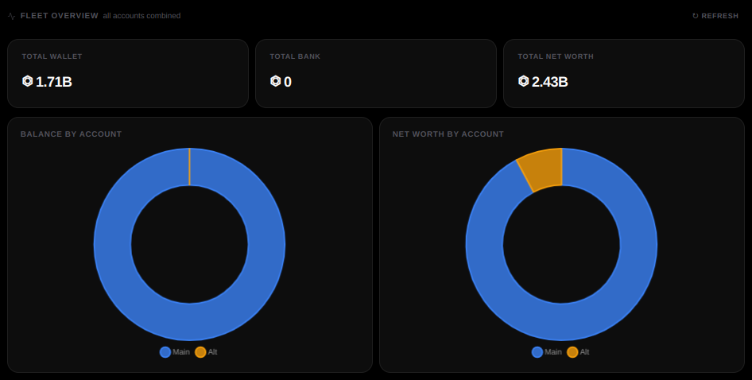

### Account Leaderboard

Sorted by net worth descending. Shows the mothership crown, online status, wallet, bank, net worth, and how recently each account's balance was updated.

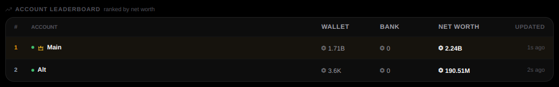

### Mothership Transfer

Support vessels can send items via Friends Share, items via Market Post, coins directly, or coins via Market Post. A notice reminds you to pause command handlers and have enough coins for market taxes before starting.

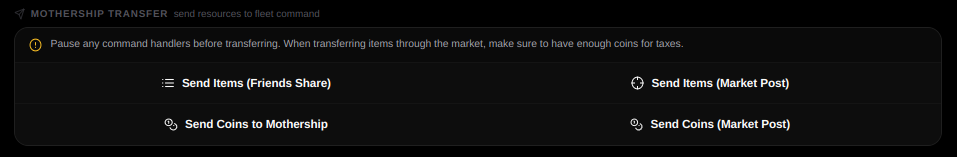

### Connection & Bot Status

Account credentials, one-click save-and-restart, and live status cards. Browser Fingerprint is always active, independent of any toggle.

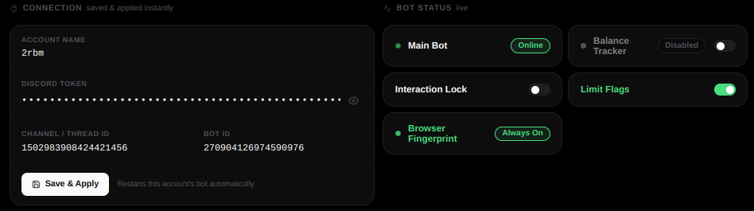

### Mothership — Primary Account

The designated mothership account is highlighted. Other accounts can transfer their full inventory and coins to it in one click.

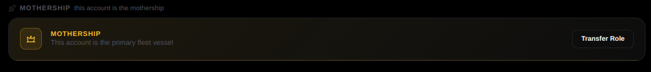

### Mothership — Support Vessel

Support vessel accounts show which mothership they belong to and expose transfer buttons.

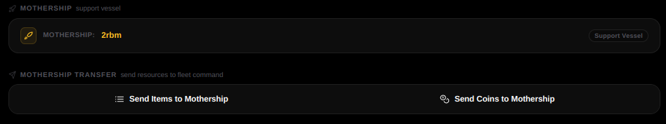

### Commands

Toggle any of the command loops on or off live. Changes take effect on the next cycle, no restart needed.

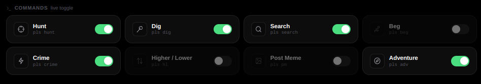

### Balance & Net Worth Tracker

Wallet, bank, and net worth polled every 30 seconds with full historical charts per account.

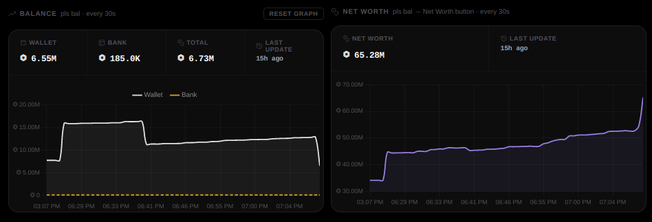

### Stealth Settings

Four anti-detection presets. Casual mode shown: 40% typing chance, 100–300ms delay, 10% cooldown variance. Uptime/Downtime cycle configured to 30min active / 10min rest.

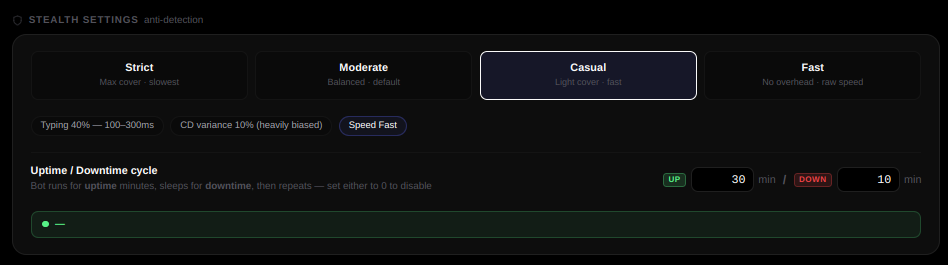

### Market Sniper

Scans `pls market view` on a configurable interval and auto-buys coin listings under your max price per item. Live buy history with per-item totals.

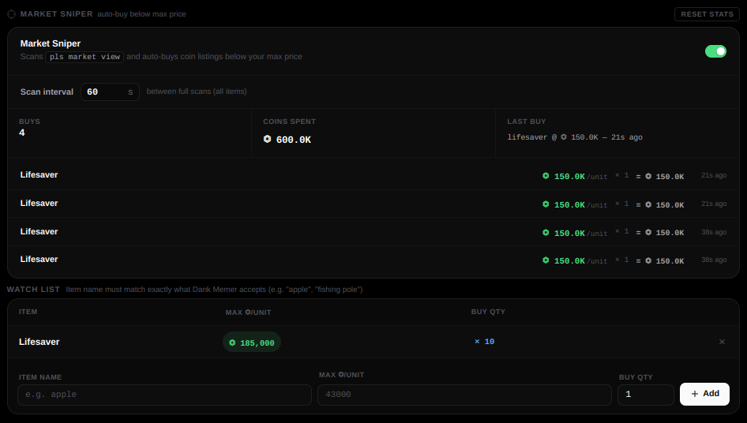

### Fishing Mode

Exclusive fishing loop, pauses all other commands and the balance tracker while active. Live stats: catches per species, bucket sells, and session time with a chart.

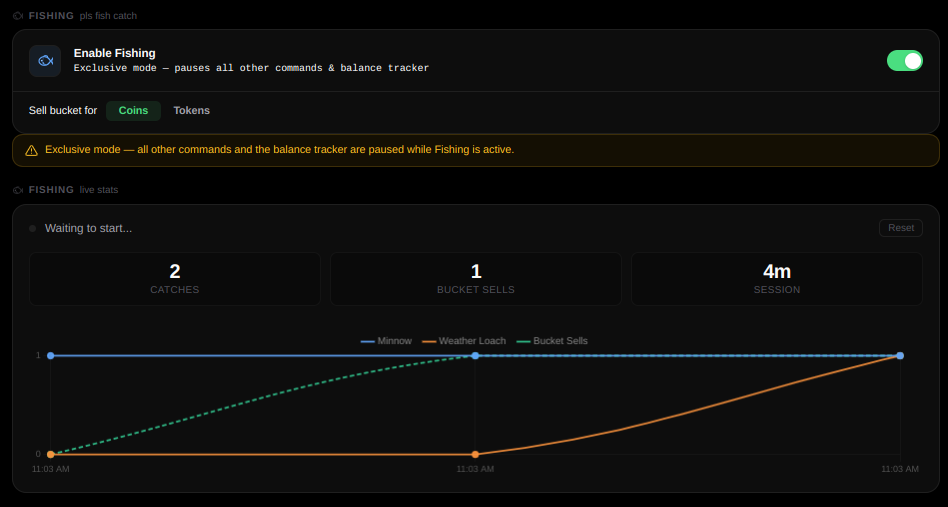

### Adventure

Select adventure type from a dropdown. Cooldown is calculated automatically after each run based on interaction count, with a 60-second safety buffer. Custom answers let you pick your own responses for each prompt.

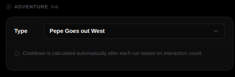

### Risk Mode — Custom Search Order

Set the search risk to Custom and drag locations into your preferred priority order. The bot works down the list from top to bottom.

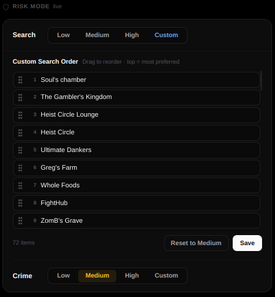

### Risk Mode — Custom Crime Order

Same drag-to-reorder system for crime. Each preset (Low, Medium, High) maps to a fixed set of safe responses; Custom lets you define your own.

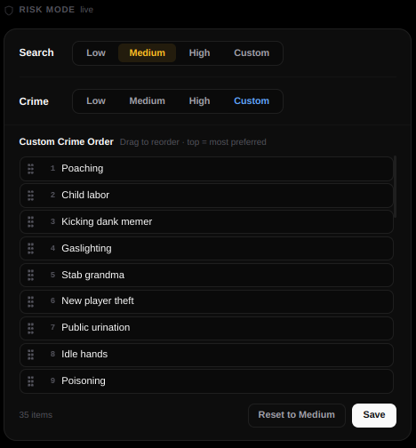

### Cooldowns & Timing

All timing values in one place. Auto-saved on change, hot-reloaded into the bot within 5 seconds.

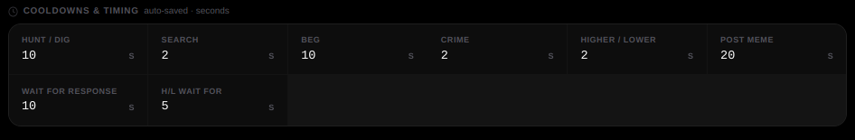

### Activity Log

Live feed of every bot action, commands sent, responses received, button clicks, sniper events, stealth delays, warnings, and errors.

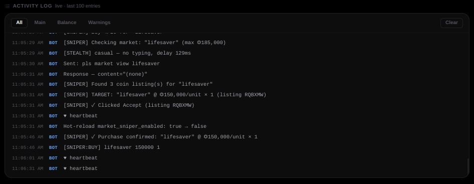

## Architecture

```
start.sh
  |
  |-- manager.js          Spawns and supervises all bot processes.
  |     |                 Watches config.json every 5s and hot-reloads
  |     |                 individual accounts without full restarts.
  |     |
  |     |-- main.js       One instance per account. Runs all command loops
  |     |                 (hunt, dig, search, beg, crime, hl, pm, adv, fish),
  |     |                 market sniper, mothership transfers, stealth logic,
  |     |                 and browser fingerprint headers.
  |     |
  |     `-- bal_tracker.js  One instance per account. Sends pls bal every
  |                         30 seconds, clicks Net Worth, records history
  |                         to balance_{id}.json.
  |
  `-- server.py           Flask server on port 5000. Serves the dashboard,
                          provides the REST API, reads/writes config.json.

web/
  index.html              Single-page dashboard.
  styles.css              All styles, dark mode, responsive layout.
  scripts.js              Polling, chart rendering, account switching,
                          toggle and config save logic.
```

**Inter-process communication:**
- `main.js` and `bal_tracker.js` POST log entries and stats to the Flask API over localhost HTTP
- A file-based interaction lock prevents `bal_tracker.js` from sending `pls bal` while a command is in-flight
- Transfer trigger files let the dashboard request a mothership transfer; `main.js` picks them up on the next cycle
- Config hot-reload: `main.js` reads `config.json` every 5 seconds and applies changed fields without restarting

## Requirements

- Node.js 18 or later
- Python 3.10 or later
- `flask` Python package
- A Discord account with a valid user token

## Installation

**Clone the repository**

```bash
git clone https://github.com/iamsoln/selfmemer.git
cd selfmemer
```

**Stop git from tracking your config (run once after cloning)**

```bash
git rm --cached config.json
```

**Install Node dependencies**

```bash
npm install
```

**Install Python dependencies**

```bash
pip install flask
```

**Create your config file**

```bash
cp config.example.json config.json
```

Open `config.json` and fill in your account details. See [Configuration](#configuration) below.

**Start the dashboard**

```bash
bash start.sh
```

Open `http://localhost:5000`. The dashboard connects to your accounts and begins running enabled commands immediately.

## Configuration

`config.json` is excluded from version control — it contains your Discord token. Use `config.example.json` as the reference template.

### Account fields

| Field | Type | Default | Description |
|---|---|---|---|
| `id` | string | — | Unique identifier. Example: `acc-1` |
| `name` | string | — | Display name in the dashboard |
| `token` | string | — | Discord user token |
| `channel_id` | string | — | Channel where Dank Memer commands are sent |
| `bot_id` | string | `270904126974590976` | Dank Memer's bot ID |
| `discord_uid` | string | `""` | Auto-populated on first run. Leave blank |
| `bal_tracker_enabled` | boolean | `true` | Run balance tracker for this account |
| `cooldown` | number | `20` | Seconds between hunt / dig commands |
| `search_cooldown` | number | `25` | Seconds between search commands |
| `beg_cooldown` | number | `40` | Seconds between beg commands |
| `crime_cooldown` | number | `40` | Seconds between crime commands |
| `hl_cooldown` | number | `10` | Seconds between higher/lower commands |
| `hl_wait_for` | number | `5` | Seconds to wait for a higher/lower response |
| `pm_cooldown` | number | `20` | Seconds between post meme commands |
| `wait_for_response` | number | `10` | Command response timeout in seconds |
| `adv_cooldown` | number | `1800` | Base adventure cooldown in seconds |
| `adv_type` | string | — | Adventure name exactly as shown in-game |
| `search_risk` | string | `medium` | `low`, `medium`, `high`, or `custom` |
| `crime_risk` | string | `medium` | `low`, `medium`, `high`, or `custom` |
| `fish_sell_currency` | string | `coins` | `coins` or `tokens` |
| `disable_interaction_lock` | boolean | `false` | Disable the single-command mutex (premium servers) |
| `commands_enabled` | object | — | Keys: `hunt` `dig` `search` `beg` `crime` `hl` `pm` `adv` `fish`. Values: `true`/`false` |
| `market_sniper_enabled` | boolean | `false` | Enable the market sniper |
| `market_sniper_cooldown` | number | `30` | Seconds between full market scans |
| `market_sniper_items` | array | `[]` | Watch list — see below |
| `market_study_item` | string | `apple` | Item used for market price research |
| `limit_flags` | boolean | `false` | Enable behavioral anti-detection (typing delays, jitter, cycling) |
| `stealth_mode` | string | `moderate` | `strict`, `moderate`, `casual`, or `fast` |
| `cycle_uptime_mins` | number | `0` | Minutes to run before pausing. 0 = disabled |
| `cycle_downtime_mins` | number | `0` | Minutes to pause before resuming. 0 = disabled |

### Market sniper item entry

```json
{
    "name": "lifesaver",
    "max_price": 200000,
    "buy_qty": 5
}
```

`name` must match the item name exactly as Dank Memer displays it. `max_price` is in coins per unit. `buy_qty` is the maximum quantity to buy per snipe event.

### Stealth mode presets

| Mode | Typing chance | Typing delay | CD variance | Speed |
|---|---|---|---|---|
| `strict` | 100% | 700–1400ms | ±35% | Slowest |
| `moderate` | 80% | 300–600ms | ±20% (biased low) | Moderate |
| `casual` | 40% | 100–300ms | ±10% (heavily biased) | Fast |
| `fast` | 0% | None | None | Maximum |

Browser fingerprint headers (Chrome 103 / Chrome OS UA, `x-super-properties`, all `Sec-*` headers) are **always active** and are not affected by `limit_flags` or stealth mode.

### Root fields

| Field | Type | Description |
|---|---|---|
| `accounts` | array | List of account objects |
| `mothership_id` | string or null | `id` of the account that receives transfers |

## Getting your Discord token

1. Open Discord in a **web browser** at `discord.com`. Do not use the desktop app.
2. Press `F12` to open developer tools.
3. Go to the **Network** tab and set the filter to **Fetch/XHR**.
4. Send any message in any channel.
5. Click one of the requests that appears. Open **Headers** then **Request Headers** and find `Authorization`. That value is your token.

> Your token gives complete access to your Discord account. Never share it, never commit `config.json`, and never paste it anywhere except your local config file.

## Security

- `config.json` is in `.gitignore` and will not be committed
- `balance_*.json` history files are also excluded
- `attached_assets/` is excluded
- Runtime state files (lock files, transfer triggers) are excluded
- No credentials are logged or sent anywhere other than directly to Discord
- The Flask server binds to `0.0.0.0:5000` — if you expose this port externally, add authentication

## License

MIT License. See [LICENSE](LICENSE) for the full text.
